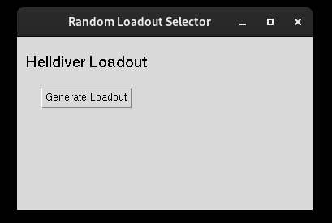
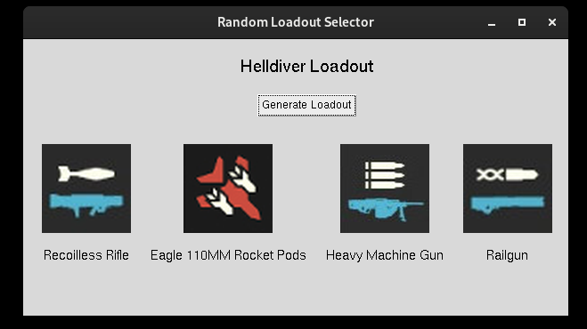
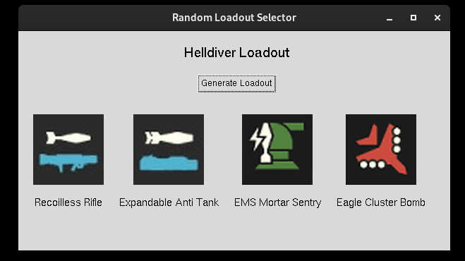

# Helldivers-2-Random-Loadout-Generator

\
\
\

## Description

A GUI based Helldiver Random Loadout Generator. Clicking on the "Generate Loadout" again will generate a new loadout.

    python3 class.py # Run from the terminal

## Requirements

    pip3 install tk

## History
Started out as a terminal based python script file to generate a random loadout. The original script file is located in the "scripts" directory.